---
## Front matter
title: "Отчёт по лабораторной работе №7"
subtitle: "Выполнил студент НКАбд-02-25"
author: "Арина Андреевна Дрекина"

## Generic otions
lang: ru-RU
toc-title: "Содержание"

## Bibliography
bibliography: bib/cite.bib
csl: pandoc/csl/gost-r-7-0-5-2008-numeric.csl

## Pdf output format
toc: true # Table of contents
toc-depth: 2
lof: false # List of figures
lot: false # List of tables
fontsize: 12pt
linestretch: 1.5
papersize: a4
documentclass: scrreprt
## I18n polyglossia
polyglossia-lang:
  name: russian
  options:
  - spelling=modern
  - babelshorthands=true
polyglossia-otherlangs:
  name: english
## I18n babel
babel-lang: russian
babel-otherlangs: english
## Fonts
mainfont: "Liberation Serif"
romanfont: "Liberation Serif"
sansfont: "Liberation Sans"
monofont: "Liberation Mono"
mainfontoptions: Ligatures=TeX
romanfontoptions: Ligatures=TeX
sansfontoptions: Ligatures=TeX,Scale=MatchLowercase
monofontoptions: Scale=MatchLowercase,Scale=0.9
## Biblatex
biblatex: true
biblio-style: "gost-numeric"
biblatexoptions:
  - parentracker=true
  - backend=biber
  - hyperref=auto
  - language=auto
  - autolang=other*
  - citestyle=gost-numeric
## Pandoc-crossref LaTeX customization
figureTitle: "Рис."
tableTitle: "Таблица"
listingTitle: "Листинг"
## Misc options
indent: true
header-includes:
  - \usepackage{indentfirst}
  - \usepackage{float} # keep figures where there are in the text
  - \floatplacement{figure}{H} # keep figures where there are in the text
---
# Цель работы
Изучение команд условного и безусловного переходов. Приобретение навыков написания программ с использованием переходов. Знакомство с назначением и структурой файла листинга.

# Порядок выполнения лабораторной работы

# Реализация переходов в NASM

Первым делом я создала каталог для лабораторной работы №7.(Рисунок 3.1)

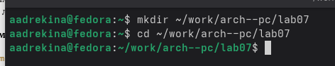{#fig:ris1.jpg width=0.7\textwidth}

Затем я создала текстовый файл для работы. (Рисунок 3.2)

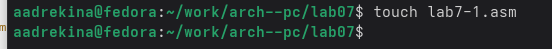{#fig:ris2.jpg width=0.7\textwidth}

Затем в созданный файл я ввела текст Листинга 7.1(Рисунок 3.3)

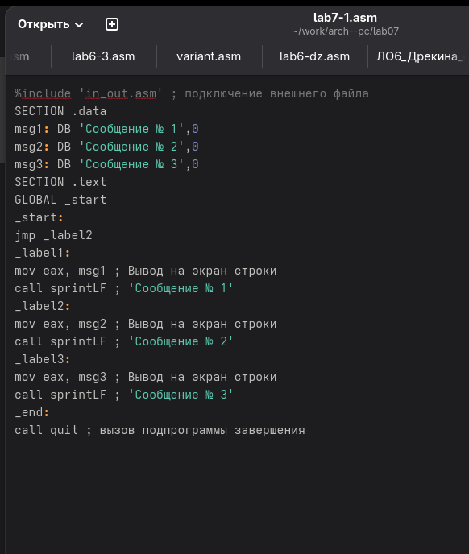{#fig:ris3.jpg width=0.7\textwidth}

Листинг 7.1:

```nasm
%include 'in_out.asm' ; подключение внешнего файла
SECTION .data
msg1: DB 'Сообщение № 1',0
msg2: DB 'Сообщение № 2',0
msg3: DB 'Сообщение № 3',0
SECTION .text
GLOBAL _start
_start:
jmp _label2
_label1:
mov eax, msg1 ; Вывод на экран строки
call sprintLF ; 'Сообщение № 1'
_label2:
mov eax, msg2 ; Вывод на экран строки
call sprintLF ; 'Сообщение № 2'
_label3:
mov eax, msg3 ; Вывод на экран строки
call sprintLF ; 'Сообщение № 3'
_end:
call quit ; вызов подпрограммы завершения
```

Затем я создала исполняемый файл и запустила его. (Рисунок 3.4)

{#fig:ris4.jpg width=0.7\textwidth}

Результат, который вывел мне терминал совпадает с тем, что написано в лекции, значит я сделала все правильно.

Затем я изменила текст программы так, чтобы сначала выводилось ‘Сообщение № 2’, потом ‘Сообщение № 1’ и работа завершалась. Текст программы я взяла из Листинга 7.2.(Рисунок 3.5)

{#fig:ris5.jpg width=0.7\textwidth}

Затем я сделала файл исполняемым и проверила его работу. (Рисунок 3.6)

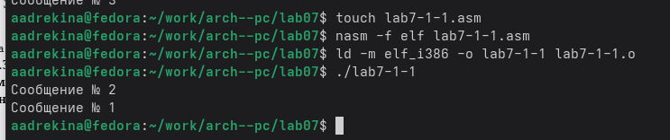{#fig:ris6.jpg width=0.7\textwidth}

На выводе вышла правильная последовательность, значит я внесла правильные изменения в программу.

Листинг 7.2:

```nasm
%include 'in_out.asm' ; подключение внешнего файла
SECTION .data
msg1: DB 'Сообщение № 1',0
msg2: DB 'Сообщение № 2',0
msg3: DB 'Сообщение № 3',0
SECTION .text
GLOBAL _start
_start:
jmp _label2
_label1:
mov eax, msg1 ; Вывод на экран строки
call sprintLF ; 'Сообщение № 1'
jmp _end
_label2:
mov eax, msg2 ; Вывод на экран строки
call sprintLF ; 'Сообщение № 2'
jmp _label1
_label3:
mov eax, msg3 ; Вывод на экран строки
call sprintLF ; 'Сообщение № 3'
_end:
call quit ; вызов подпрограммы завершения
```

Далее я изменила программу так, чтобы программа выводила сначала "Сообщение № 3", потом "Сообщение № 2" и в конце "Сообщение № 1". (Рисунок 3.7)

{#fig:ris7.jpg width=0.7\textwidth}

Затем я запустила полученную программу (Рисунок 3.8)

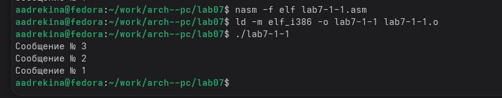{#fig:ris8.jpg width=0.7\textwidth}

У меня вывелась правильная последовательность, значит я правильно внесла изменения и поняла как работает программа.

Далее я создала еще один файл для работы. (Рисунок 3.9)

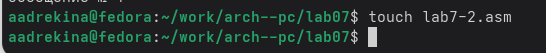{#fig:ris9.jpg width=0.7\textwidth}

В созданный файл я ввела текст из Листинга 7.3. (Рисунок 3.10)

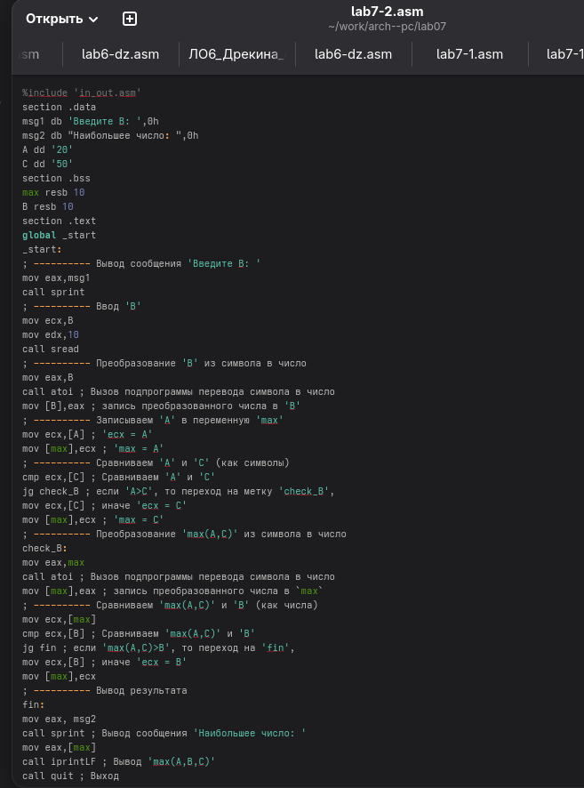{#fig:ris10.jpg width=0.7\textwidth}

Листинг 7.3:

```nasm
%include 'in_out.asm'
section .data
msg1 db 'Введите B: ',0h
msg2 db "Наибольшее число: ",0h
A dd '20'
C dd '50'
section .bss
max resb 10
B resb 10
section .text
global _start
_start:
; ---------- Вывод сообщения 'Введите B: '
mov eax,msg1
call sprint
; ---------- Ввод 'B'
mov ecx,B
mov edx,10
call sread
; ---------- Преобразование 'B' из символа в число
mov eax,B
call atoi ; Вызов подпрограммы перевода символа в число
mov [B],eax ; запись преобразованного числа в 'B'
; ---------- Записываем 'A' в переменную 'max'
mov ecx,[A] ; 'ecx = A'
mov [max],ecx ; 'max = A'
; ---------- Сравниваем 'A' и 'С' (как символы)
cmp ecx,[C] ; Сравниваем 'A' и 'С'
jg check_B ; если 'A>C', то переход на метку 'check_B',
mov ecx,[C] ; иначе 'ecx = C'
mov [max],ecx ; 'max = C'
; ---------- Преобразование 'max(A,C)' из символа в число
check_B:
mov eax,max
call atoi ; Вызов подпрограммы перевода символа в число
mov [max],eax ; запись преобразованного числа в `max`
; ---------- Сравниваем 'max(A,C)' и 'B' (как числа)
mov ecx,[max]
cmp ecx,[B] ; Сравниваем 'max(A,C)' и 'B'
jg fin ; если 'max(A,C)>B', то переход на 'fin',
mov ecx,[B] ; иначе 'ecx = B'
mov [max],ecx
; ---------- Вывод результата
fin:
mov eax, msg2
call sprint ; Вывод сообщения 'Наибольшее число: '
mov eax,[max]
call iprintLF ; Вывод 'max(A,B,C)'
call quit ; Выход
```

Затем я создала исполняемый файл и запустила программу. (Рисунок 3.11)

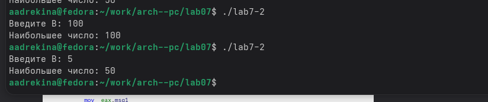{#fig:ris12.jpg width=0.7\textwidth}

Я ввела несколько разных значений B, чтобы убедиться в корректности работы программы. 

# Изучение структуры файлы листинга.

Теперь я создала файл листинга для программы из файла "lab7-2.asm", с помощью ключа -l. (Рисунок 4.1)

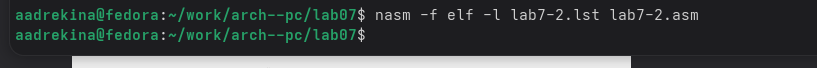{#fig:ris13.jpg width=0.7\textwidth}

Затем я открыла созданный файл с помощью редактора mcedit. (Рисунок 4.2) 

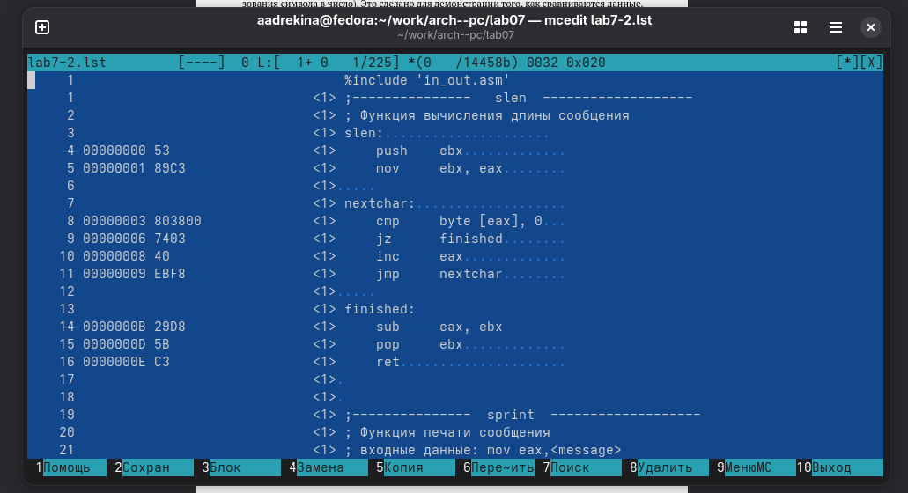{#fig:ris14.jpg width=0.7\textwidth}

Я ознакомилась с содержимым. Я выбрала три строки, чтобы описать содержимое: 

Первая строка:

6 - "00000039 35300000 C dd '50'", эта инструкция хранит в переменной C значение "50" в виде символьных байт. dd записывает в секцию указанное значение в виде 32-битного слова. Кавычки около 50 означают, что это не число, а символьное выражение. 00000039 - адрес где в памяти лежит C. 35300000 - значение, которое ассемблер записал в память по этому адресу.

Вторая строка:

14 - "000000E8 B8[00000000] mov eax,msg1", эта инструкция кладет в регистр eax адрес строки msg1. [00000000] - это место, куда подставится реальный адрес метки. 000000E8 - адрес команды в памяти. B8 -  код операции mov  в регистре eax.

Третья строка: 

23 "0000010B A3[0A000000] mov [B],eax", mov это команда перемещения данных в x86, [B] обращение к памяти по адресу B, eax регистор в которм хранится результат функции atoi. Если смотреть в общем, то это строка копирует число из регистра eax и переносит его в переменную B.

Далее я открыла файл lab7-2.asm и в инструкции с двумя операндами удалила один. (Рисунок 4.3)

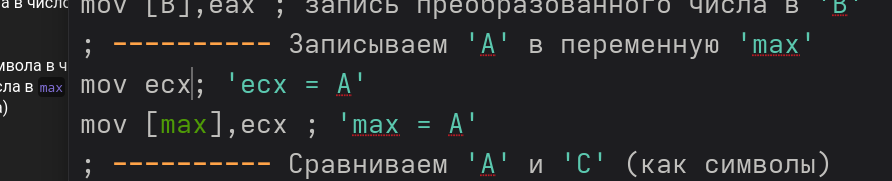{#fig:ris19.jpg width=0.7\textwidth}

Затем я попыталась сделать файл исполняемым, но вышла ошибка. Все потому что инструкция ожидает на вход два операнда. (Рисунок 4.4)

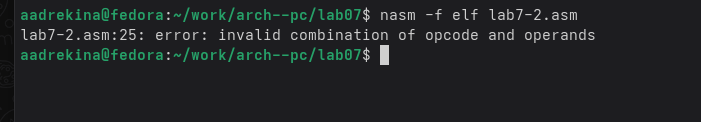{#fig:ris20.jpg width=0.7\textwidth}

# Задание для самостоятельной работы.

Далее я создала файл для самостоятельно работы. И на основе Листингов из лекции составила программу. Значения переменных я взяла из 9 варианта.(Рисунок 5.1)

{#fig:ris15.jpg width=0.7\textwidth}

Затем я запустила программу. (Рисунок 5.2)

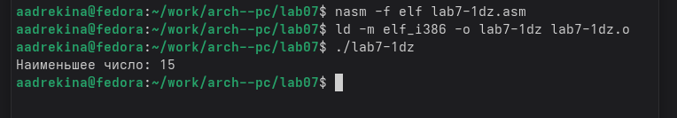{#fig:ris16.jpg width=0.7\textwidth}

На выходе у меня получилось, что самое минимальное число это 15, что соответствует действительности.

Теперь я создала еще один текстовый файл. Написала туда другую программу, так же основываясь на Листингах из лекции. (Рисунок 5.3)

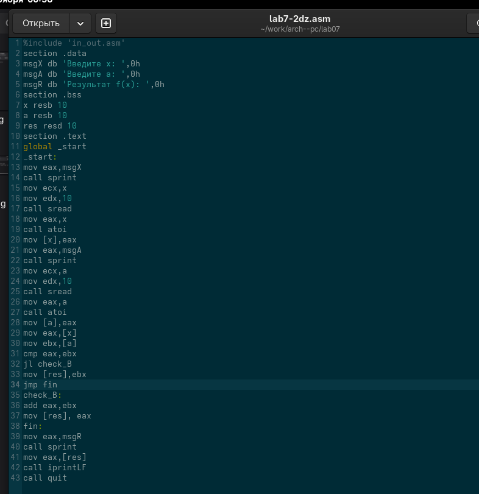{#fig:ris17.jpg width=0.7\textwidth}

Затем я запустила программу и ввела данные из варианта №9. (Рисунок 5.4)

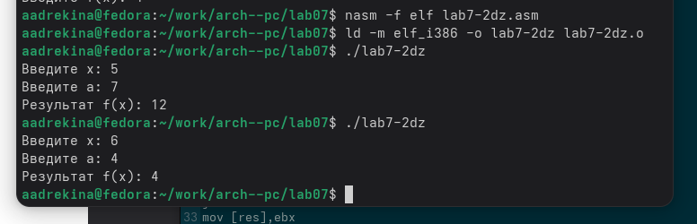{#fig:ris18.jpg width=0.7\textwidth}

После запуска, я проверила в ручную. Вывод программы совпал с моими вычислениями. Значит, программа написана правильно.

# Вывод

Я изучила команды условного и безусловного переходов. Приобрела навыки написания программ с использованием переходов. Ознакомилась с назначением и структурой файла листинга. И все полученные знания применила на практике. 
