---
## Front matter
title: "Отчёт по лабораторной работе №8"
subtitle: "Выполнил студент НКАбд-02-25"
author: "Арина Андреевна Дрекина"

## Generic otions
lang: ru-RU
toc-title: "Содержание"

## Bibliography
bibliography: bib/cite.bib
csl: pandoc/csl/gost-r-7-0-5-2008-numeric.csl

## Pdf output format
toc: true # Table of contents
toc-depth: 2
lof: false # List of figures
lot: false # List of tables
fontsize: 12pt
linestretch: 1.5
papersize: a4
documentclass: scrreprt
## I18n polyglossia
polyglossia-lang:
  name: russian
  options:
  - spelling=modern
  - babelshorthands=true
polyglossia-otherlangs:
  name: english
## I18n babel
babel-lang: russian
babel-otherlangs: english
## Fonts
mainfont: "Liberation Serif"
romanfont: "Liberation Serif"
sansfont: "Liberation Sans"
monofont: "Liberation Mono"
mainfontoptions: Ligatures=TeX
romanfontoptions: Ligatures=TeX
sansfontoptions: Ligatures=TeX,Scale=MatchLowercase
monofontoptions: Scale=MatchLowercase,Scale=0.9
## Biblatex
biblatex: true
biblio-style: "gost-numeric"
biblatexoptions:
  - parentracker=true
  - backend=biber
  - hyperref=auto
  - language=auto
  - autolang=other*
  - citestyle=gost-numeric
## Pandoc-crossref LaTeX customization
figureTitle: "Рис."
tableTitle: "Таблица"
listingTitle: "Листинг"
## Misc options
indent: true
header-includes:
  - \usepackage{indentfirst}
  - \usepackage{float} # keep figures where there are in the text
  - \floatplacement{figure}{H} # keep figures where there are in the text
---
# Цель работы.
Приобретение навыков написания программ с использованием циклов и обработкой аргументов командной строки.

# Порядок выполнения лабораторной работы.

# Реализация циклов в NASM.

Я создала каталог для программ, которые будут созданы во время выполнения лабораторной работы №8. (Рисунок 3.1)

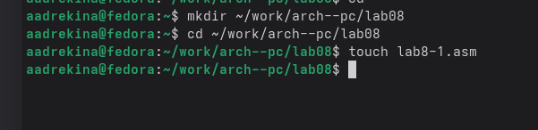{#fig:ris1.jpg width=0.7\textwidth}

Затем я создала текстовый файл для программы и добавила в него Листинг 8.1. Я внимательно изучила программу. (Рисунок 3.2)

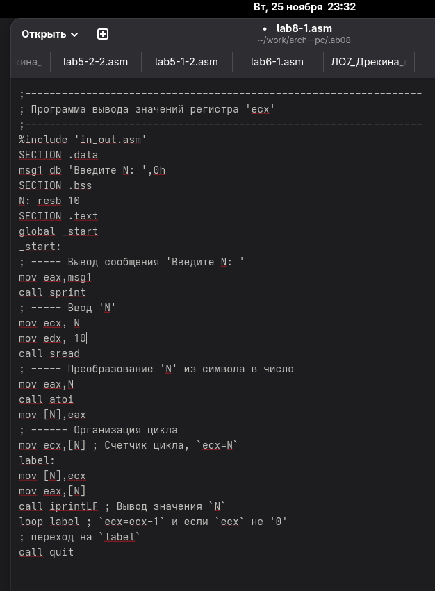{#fig:ris2.jpg width=0.7\textwidth}

Далее я запустила этот файл. (Рисунок 3.3)

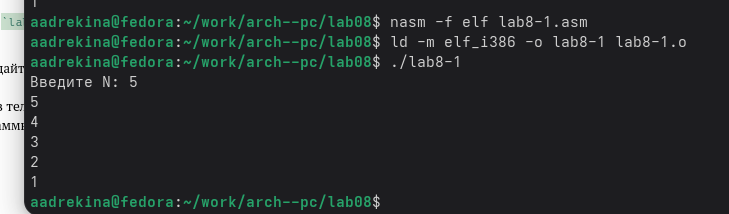{#fig:ris3.jpg width=0.7\textwidth}

Листинг 8.1:

```nasm
;-----------------------------------------------------------------
; Программа вывода значений регистра 'ecx'
;-----------------------------------------------------------------
%include 'in_out.asm'
SECTION .data
msg1 db 'Введите N: ',0h
SECTION .bss
N: resb 10
SECTION .text
global _start
_start:
; ----- Вывод сообщения 'Введите N: '
mov eax,msg1
call sprint
; ----- Ввод 'N'
mov ecx, N
mov edx, 10
call sread
; ----- Преобразование 'N' из символа в число
mov eax,N
call atoi
mov [N],eax
; ------ Организация цикла
mov ecx,[N] ; Счетчик цикла, `ecx=N`
label:
mov [N],ecx
mov eax,[N]
call iprintLF ; Вывод значения `N`
loop label ; `ecx=ecx-1` и если `ecx` не '0'
; переход на `label`
call quit
```

Затем я внесла изменения уже в созданный Листинг. (Рисунок 3.4)

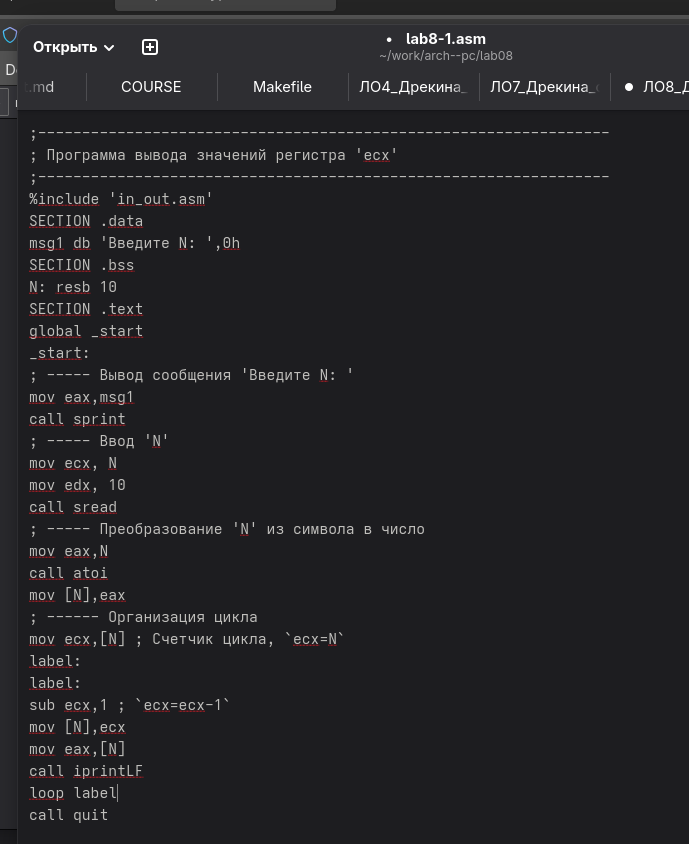{#fig:ris16.jpg width=0.7\textwidth}

Потом я запустила программу. (Рисунок 3.5, Рисунок 3.6)

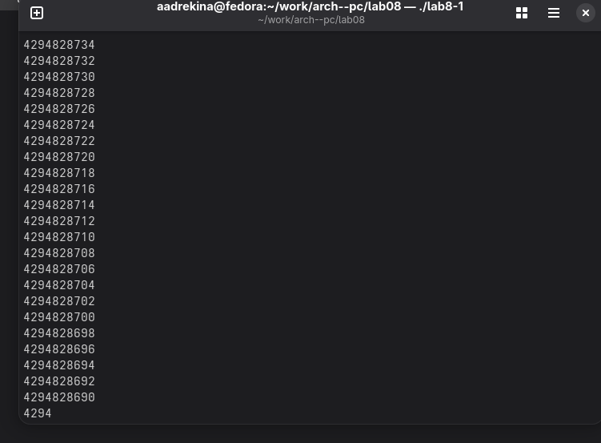{#fig:ris5.jpg width=0.7\textwidth}

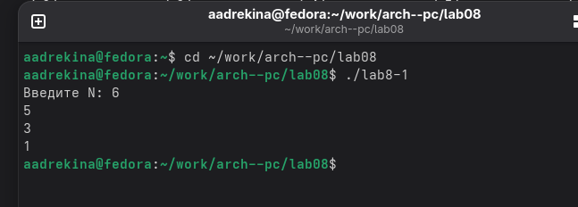{#fig:ris6.jpg width=0.7\textwidth}

Я ввела два значения, 5 и 6. Увидев разницу в выводе я решила ввести еще пару значений и заметила, что для четных чисел ответ выводится, а для нечетных выводится бесконечное количество чисел. 

Первые изменения в программе:

```asm
label:
sub ecx,1 ; `ecx=ecx-1`
mov [N],ecx
mov eax,[N]
call iprintLF
loop label
```

Затем я внесла еще одно изменение в программу. (Рисунок 3.7)

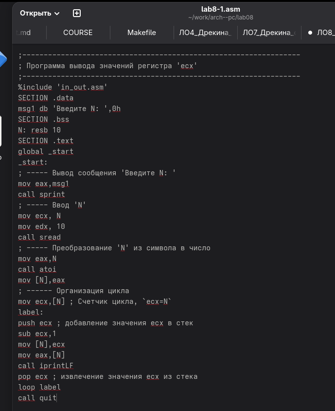{#fig:ris15.jpg width=0.7\textwidth}

Вторые изменения в программме:

```asm
label:
push ecx
sub ecx,1
mov [N],ecx
mov eax,[N]
call iprintLF
pop ecx
loop label
```

Далее я запустила измененный файл. (Рисунок 3.8)

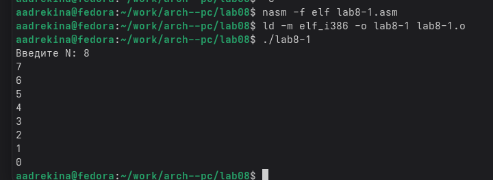{#fig:ris6.jpg width=0.7\textwidth}

Теперь программа выводит правильный ответ, она уменьшает полученное на вход число на 1, причем вывод начинается уже с уменьшенного числа, а не с введенного как было в первой программе.

# Обработка аргументов командной строки.

Я создала еще один текстовый файл. И ввела туда текст программы из Листинга 8.2.(Рисунок 4.1)

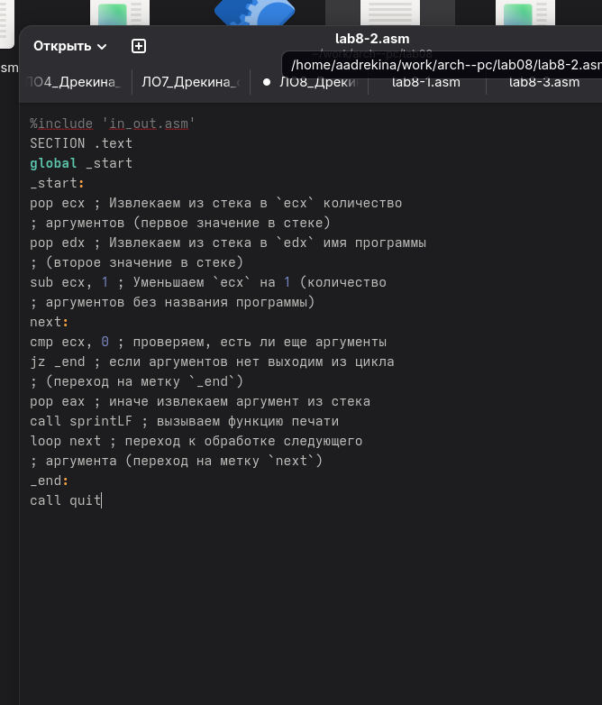{#fig:ris14.jpg width=0.7\textwidth}

Затем я запустила эту программу и указала аргументы. (Рисунок 4.2)

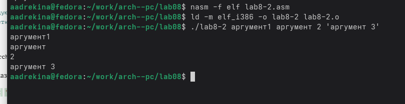{#fig:ris7.jpg width=0.7\textwidth}

У меня вывелись все три аргумента, однако с отличиями. Например: номер первого аргумента был написан без пробела, номер второго перешел на новую строку, а номер третьего был написан через пробел.

Листинг 8.2:

```asm
;-----------------------------------------------------------------
; Обработка аргументов командной строки
;-----------------------------------------------------------------
%include 'in_out.asm'
SECTION .text
global _start
_start:
pop ecx ; Извлекаем из стека в `ecx` количество
; аргументов (первое значение в стеке)
pop edx ; Извлекаем из стека в `edx` имя программы
; (второе значение в стеке)
sub ecx, 1 ; Уменьшаем `ecx` на 1 (количество
; аргументов без названия программы)
next:
cmp ecx, 0 ; проверяем, есть ли еще аргументы
jz _end ; если аргументов нет выходим из цикла
; (переход на метку `_end`)
pop eax ; иначе извлекаем аргумент из стека
call sprintLF ; вызываем функцию печати
loop next ; переход к обработке следующего
; аргумента (переход на метку `next`)
_end:
call quit
```

Затем я создала еще один файл и вставила туда текст из листинга 8.3. (Рисунок 4.3)

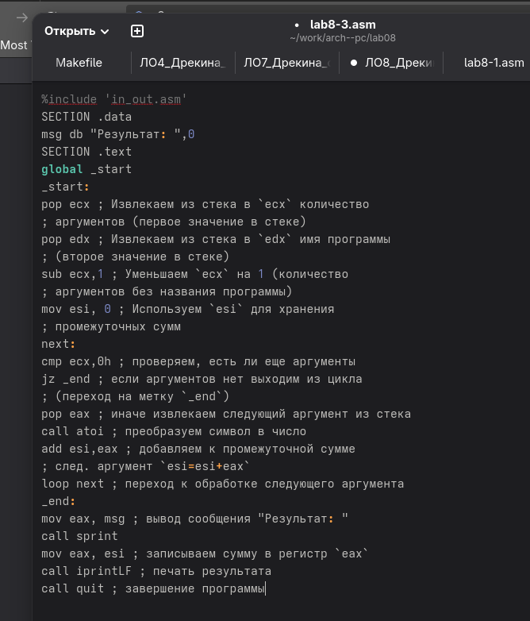{#fig:ris13.jpg width=0.7\textwidth}

Теперь я запустила файл. (Рисунок 4.4)

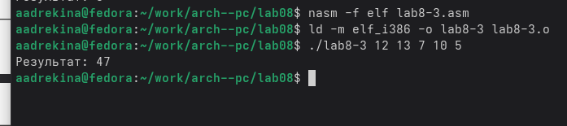{#fig:ris8.jpg width=0.7\textwidth}

Я ввела те же значения, что и в лекции, чтобы проверить корректность работы. Результат, который вывелся у меня, совпал с результатом из лекции.

Листинг 8.3:

```asm
%include 'in_out.asm'
SECTION .data
msg db "Результат: ",0
SECTION .text
global _start
_start:
pop ecx ; Извлекаем из стека в `ecx` количество
; аргументов (первое значение в стеке)
pop edx ; Извлекаем из стека в `edx` имя программы
; (второе значение в стеке)
sub ecx,1 ; Уменьшаем `ecx` на 1 (количество
; аргументов без названия программы)
mov esi, 0 ; Используем `esi` для хранения
; промежуточных сумм
next:
cmp ecx,0h ; проверяем, есть ли еще аргументы
jz _end ; если аргументов нет выходим из цикла
; (переход на метку `_end`)
pop eax ; иначе извлекаем следующий аргумент из стека
call atoi ; преобразуем символ в число
add esi,eax ; добавляем к промежуточной сумме
; след. аргумент `esi=esi+eax`
loop next ; переход к обработке следующего аргумента
_end:
mov eax, msg ; вывод сообщения "Результат: "
call sprint
mov eax, esi ; записываем сумму в регистр `eax`
call iprintLF ; печать результата
call quit ; завершение программы
```

Далее я изменила программу, чтобы она не складывала, а перемножала числа. (Рисунок 4.5)

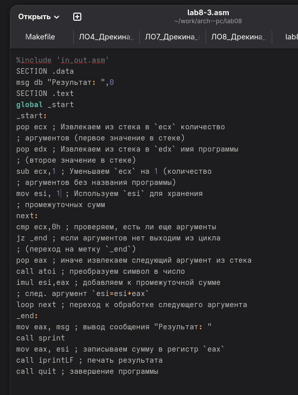{#fig:ris12.jpg width=0.7\textwidth}

Теперь я создала исполняемый файл и запустила программу. (Рисунок 4.6)

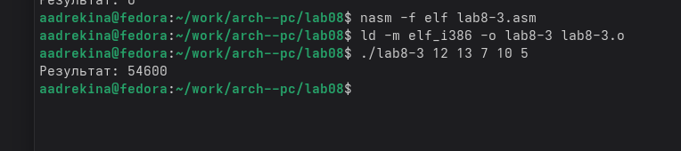{#fig:ris9.jpg width=0.7\textwidth}

Я получила вывод, и затем перепроверила его вручную. Ответ который мне вывел терминал, и тот который получила я, совпали.

# Задание для самостоятельной работы.

Я написала программу, которая будет находить сумму значений функции для x. Функцию я взяла из таблицы вариантов из лекции. Мой вариант - 9. (Рисунок 5.1)

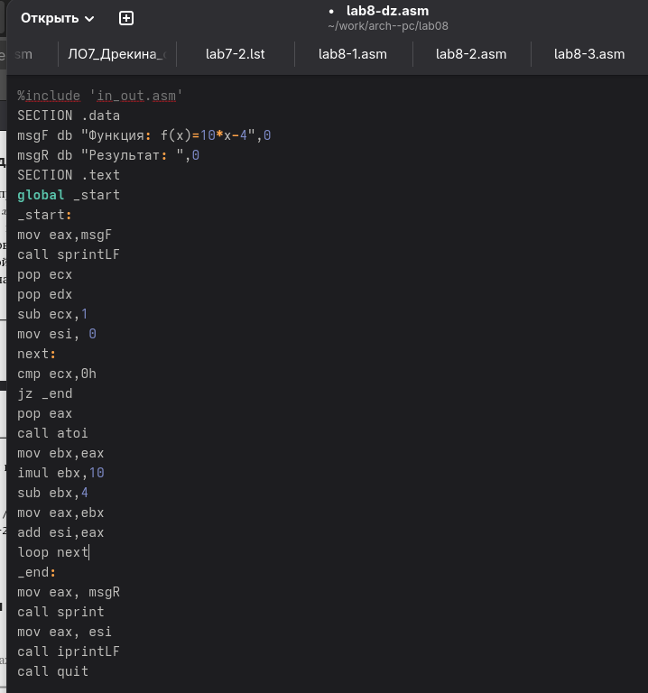{#fig:ris10.jpg width=0.7\textwidth}

После этого я запустила программу. (Рисунок 5.2)

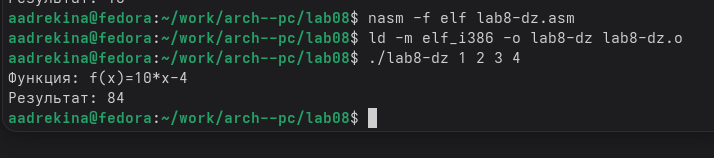{#fig:ris11.jpg width=0.7\textwidth}

Я перепроверила вручную, и сравнила полученные ответ. Они совпали. Это означает, что программу я написала правильно и освоила материал лекции.

# Вывод.

В ходе выполнения 8 лабораторной работы я приобрела навыки написания программ с использованием циклов и обработкой аргументов командной строки. А также применила их на практике. 
