---
## Front matter
title: "Отчёт по лабораторной работе №9"
subtitle: "Выполнил студент НКАбд-02-25"
author: "Арина Андреевна Дрекина"

## Generic otions
lang: ru-RU
toc-title: "Содержание"

## Bibliography
bibliography: bib/cite.bib
csl: pandoc/csl/gost-r-7-0-5-2008-numeric.csl

## Pdf output format
toc: true # Table of contents
toc-depth: 2
lof: false # List of figures
lot: false # List of tables
fontsize: 12pt
linestretch: 1.5
papersize: a4
documentclass: scrreprt
## I18n polyglossia
polyglossia-lang:
  name: russian
  options:
  - spelling=modern
  - babelshorthands=true
polyglossia-otherlangs:
  name: english
## I18n babel
babel-lang: russian
babel-otherlangs: english
## Fonts
mainfont: "Liberation Serif"
romanfont: "Liberation Serif"
sansfont: "Liberation Sans"
monofont: "Liberation Mono"
mainfontoptions: Ligatures=TeX
romanfontoptions: Ligatures=TeX
sansfontoptions: Ligatures=TeX,Scale=MatchLowercase
monofontoptions: Scale=MatchLowercase,Scale=0.9
## Biblatex
biblatex: true
biblio-style: "gost-numeric"
biblatexoptions:
  - parentracker=true
  - backend=biber
  - hyperref=auto
  - language=auto
  - autolang=other*
  - citestyle=gost-numeric
## Pandoc-crossref LaTeX customization
figureTitle: "Рис."
tableTitle: "Таблица"
listingTitle: "Листинг"
## Misc options
indent: true
header-includes:
  - \usepackage{indentfirst}
  - \usepackage{float} # keep figures where there are in the text
  - \floatplacement{figure}{H} # keep figures where there are in the text
---
# Цель работы.
Приобретение навыков написания программ с использованием подпрограмм. Знакомство с методами отладки при помощи GDB и его основными возможностями.

# Порядок выполнения лабораторной работы.

# Реализация подпрограмм в NASM.

Я создала каталог для выполнения лабораторной работы №9, затем перешла в него и создала текстовый файл lab09-1.asm. (Рисунок 3.1)

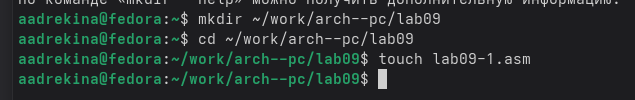{#fig:ris1.jpg width=0.7\textwidth}

Я ввела в файл текст из Листинга 9.1. Перед этим изучила программу (Рисунок 3.2)

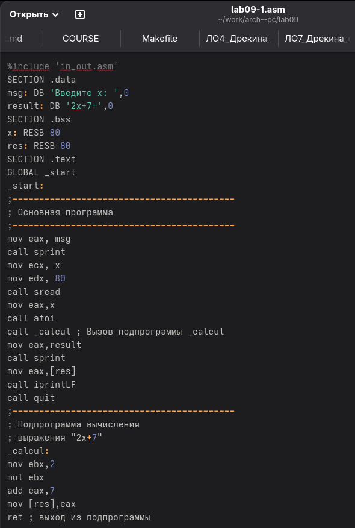{#fig:ris2.jpg width=0.7\textwidth}

Потом я запустила программу. (Рисунок 3.3)

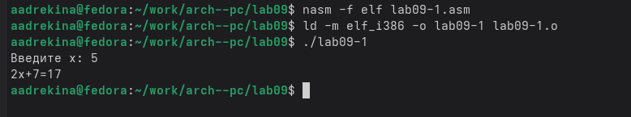{#fig:ris3.jpg width=0.7\textwidth}

Листинг 9.1:

```asm
%include 'in_out.asm'
SECTION .data
msg: DB 'Введите x: ',0
result: DB '2x+7=',0
SECTION .bss
x: RESB 80
res: RESB 80
SECTION .text
GLOBAL _start
_start:
;------------------------------------------
; Основная программа
;------------------------------------------
mov eax, msg
call sprint
mov ecx, x
mov edx, 80
call sread
mov eax,x
call atoi
call _calcul ; Вызов подпрограммы _calcul
mov eax,result
call sprint
mov eax,[res]
call iprintLF
call quit
;------------------------------------------
; Подпрограмма вычисления
; выражения "2x+7"
_calcul:
mov ebx,2
mul ebx
add eax,7
mov [res],eax
ret ; выход из подпрограммы
```

Потом я изменила текст программы, добавив подпрограмму _subcalcul в подпрограмму _calcul, чтобы вычислялось выражение f(g(x)), где x вводится с клавиатуры, f(x)=2*x+7, g(x)=3*x-1 . (Рисунок 3.4)

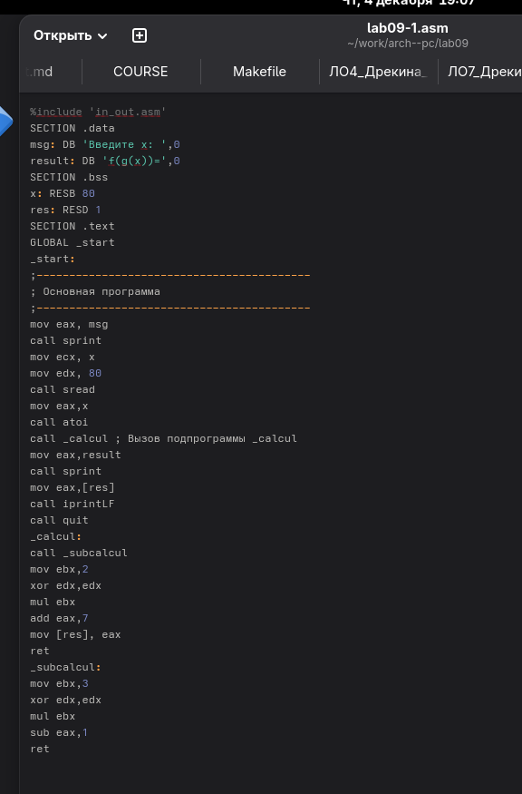{#fig:ris4.jpg width=0.7\textwidth}

Затем я сделала файл исполняемым и запустила программу. (Рисунок 3.5)

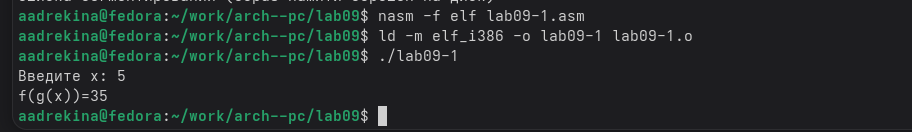{#fig:ris5.jpg width=0.7\textwidth}

Программа посчитала все правильно и я продолжила работу дальше.

# Отладка программам с помощью GDB.

Затем я создала еще один текстовый файл и ввела текст из Листинга 9.2. (Рисунок 4.1)

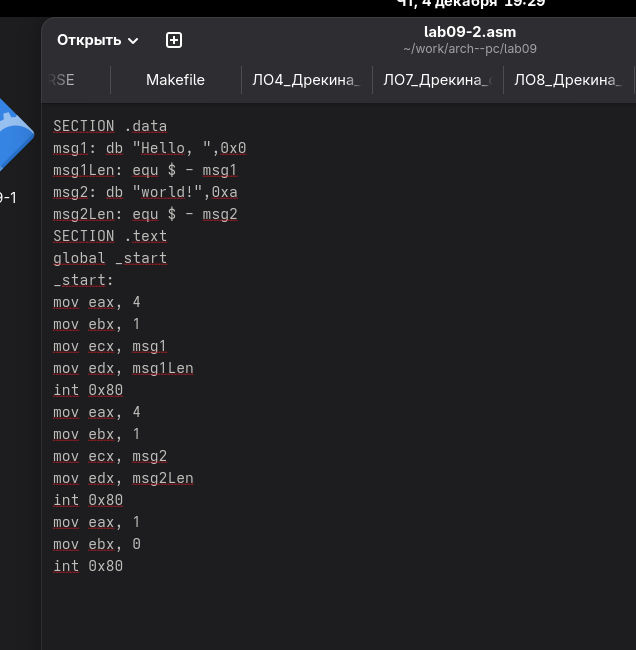{#fig:ris6.jpg width=0.7\textwidth}

Листинг 9.2:

```nasm 
SECTION .data
msg1: db "Hello, ",0x0
msg1Len: equ $ - msg1
msg2: db "world!",0xa
msg2Len: equ $ - msg2
SECTION .text
global _start
_start:
mov eax, 4
mov ebx, 1
mov ecx, msg1
mov edx, msg1Len
int 0x80
mov eax, 4
mov ebx, 1
mov ecx, msg2
mov edx, msg2Len
int 0x80
mov eax, 1
mov ebx, 0
int 0x80
```

Потом я сделала этот файл исполняемым, но для работы с GDB в исполняемый файл я добавила отладочную информацию, для этого трансляцию  программы я провела с ключом "-g". (Рисунок 4.2)

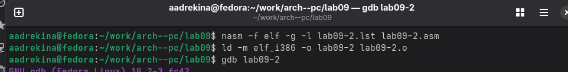{#fig:ris39.jpg width=0.7\textwidth}

Затем я загрузила исполняемый файл в отладчик gdb. (Рисунок 4.3)

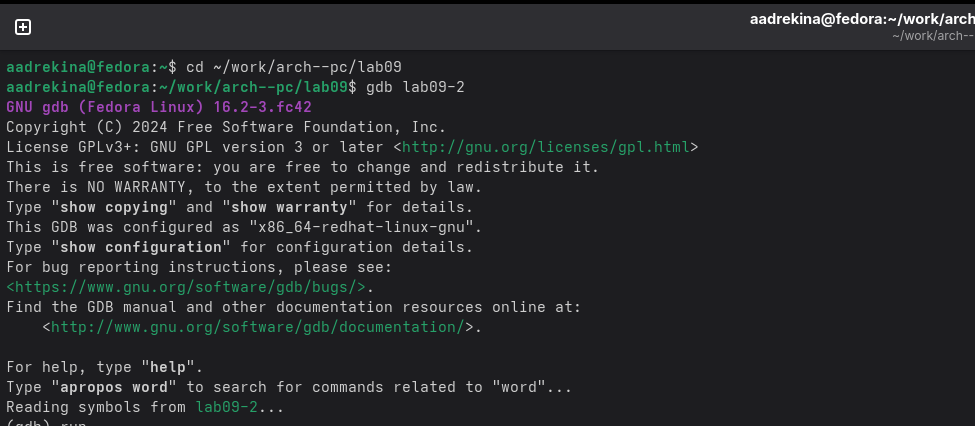{#fig:ris7.jpg width=0.7\textwidth}

Затем, чтобы проверить работу программы, я запустила эту программу в оболочке GDB с помощью команды run. (рисунок 4.4)

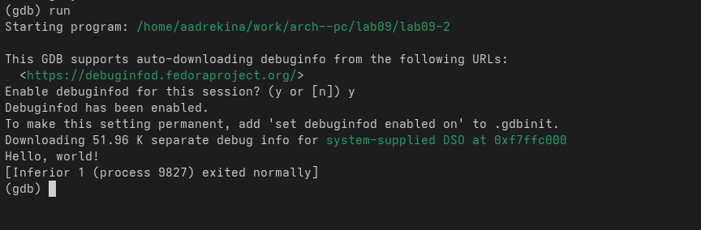{#fig:ris8.jpg width=0.7\textwidth}

Затем, чтобы более подробно проанализировать эту программу я установила брейкпоинт на метку _start. (Рисунок 4.5)

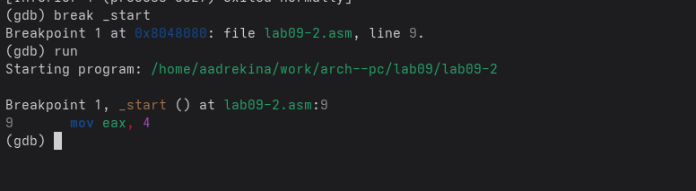{#fig:ris9.jpg width=0.7\textwidth}

Затем я посмотрела дисассимилированный код программы с помощью команды disassemble начиная с метки _start. (Рисунок 4.6)

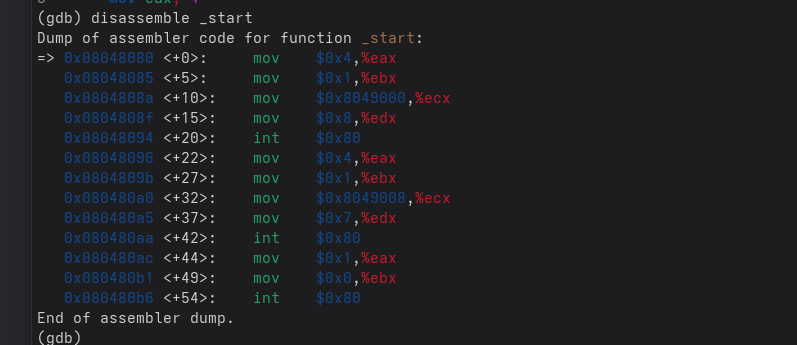{#fig:ris10.jpg width=0.7\textwidth}

Затем я переключилась на отображение команд с Intel’овским синтаксисом, введя команду set
disassembly-flavor intel. (Рисунок 4.7)

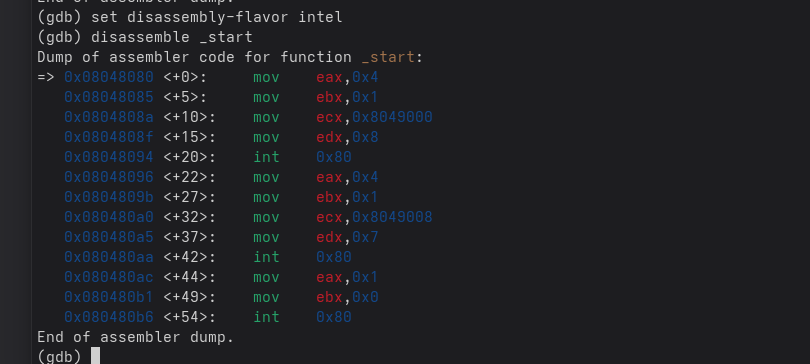{#fig:ris11.jpg width=0.7\textwidth}

Различия отображения синтаксиса машинных команд в режимах ATT и Intel заключается в том, что в Intel синтаксические операнды идут в порядке dst,src и еще регистры пишутся без %. А в ATT синтаксис обратный, сначала src, а потом dst и при этом используется % для регистров и $ для констант.

Затем я включила режим псевдографики, чтобы анализировать программы было удобнее. (Рисунок 4.8)

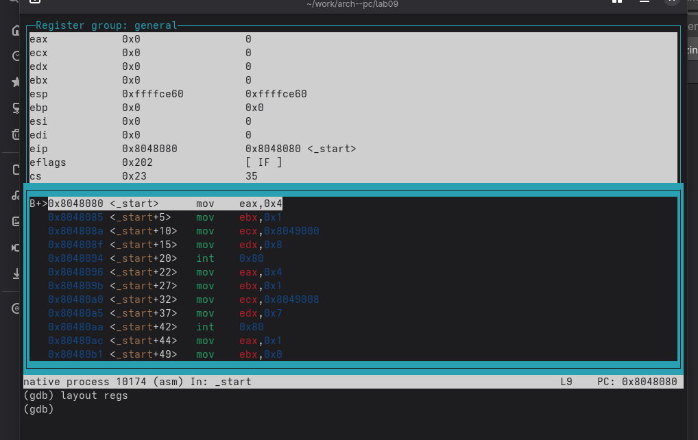{#fig:ris12.jpg width=0.7\textwidth}

# Добавление точек останова.

С помощью команды info breakpoints (кратко i b) я проверила установлена ли точка останова. (Рисунок 5.1)

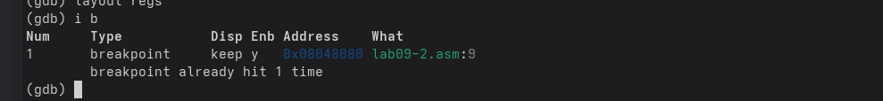{#fig:ris13.jpg width=0.7\textwidth}

Затем я установила еще одну точку останова по адресу инструкции. Адрес я взяла у предпоследней инструкции (mov ebx, 0x0) (Рисунок 5.2)

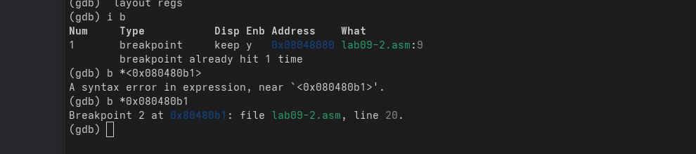{#fig:ris14.jpg width=0.7\textwidth}

Затем я еще раз ввела команду info breakpoints, чтобы посмотреть информацию о всех установленных точках останова. (Рисунок 5.3)

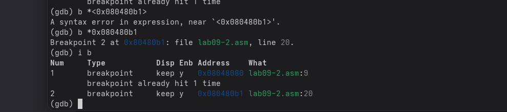{#fig:ris40.jpg width=0.7\textwidth}

# Работа с данными программы в GDB.

Я выполнила 5 инструкций с помощью команды stepi(или si). (Рисунок 6.1), (Рисунок 6.2),(Рисунок 6.3),(Рисунок 6.4),(Рисунок 6.5)

{#fig:ris50.jpg width=0.7\textwidth}

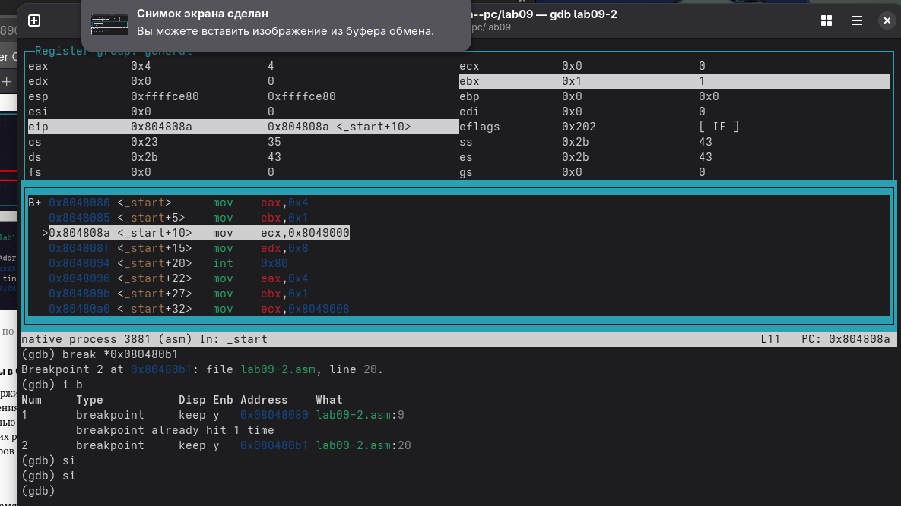{#fig:ris51.jpg width=0.7\textwidth}

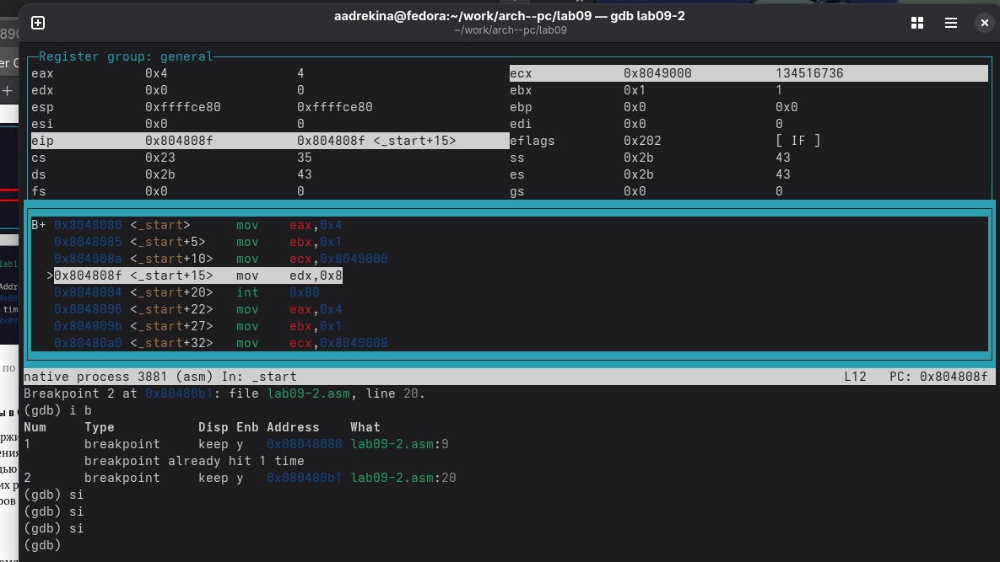{#fig:ris52.jpg width=0.7\textwidth}

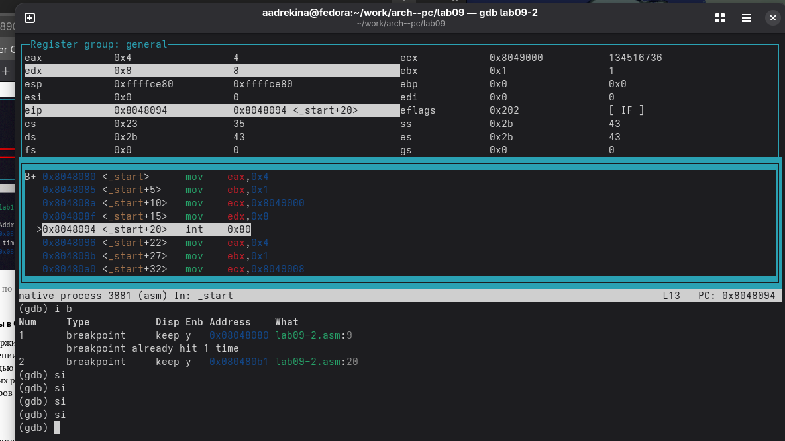{#fig:ris53.jpg width=0.7\textwidth}

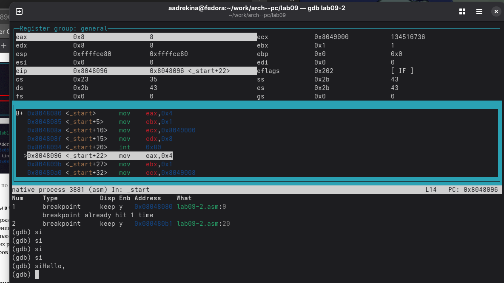{#fig:ris54.jpg width=0.7\textwidth}

Я внимательно изучила эти 5 скринов, и проследила за изменением регистров. Меняются такие регистры как: EAX,EBX,ECX,EDX.

Я посмотрела содержимое регистров с помощью команды info registers. (Рисунок 6.6)

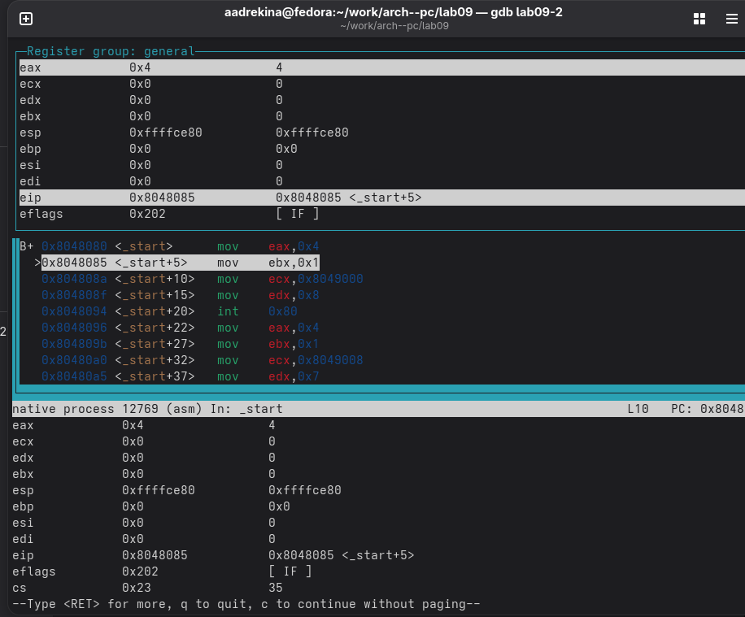{#fig:ris15.jpg width=0.7\textwidth}

Потом я посмотрела значение переменной msg1 по имени. (Рисунок 6.7)

{#fig:ris16.jpg width=0.7\textwidth}

У меня вывелся такой же ответ, как и в лекции, значит я сделала все правильно.

Потом, таким же образом я посмотрела значение переменной msg2 по адресу. (Рисунок 6.8)

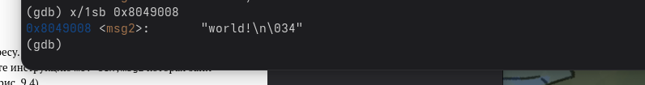{#fig:ris17.jpg width=0.7\textwidth}

Затем я изменила значение для регистра с помощью команды set. (Рисунок 6.9)

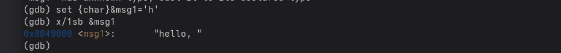{#fig:ris18.jpg width=0.7\textwidth}

Ответ вывелся такой же, значит я сделал все правильно. 

Затем я также изменила значение для регистра msg2. (Рисунок 6.10)

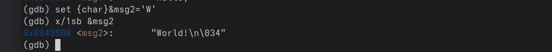{#fig:ris22.jpg width=0.7\textwidth}

Затем с помощью команды set я изменила значение регистра. (Рисунок 6.11)

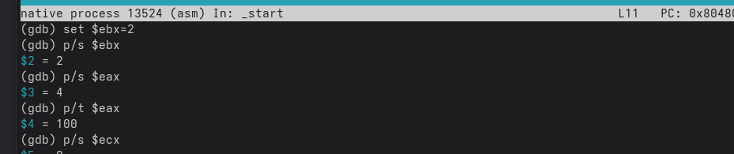{#fig:ris23.jpg width=0.7\textwidth}

Команда p/s $ebx выводит строку по адресу, хранящемуся в ebx, следовательно при set $ebx="2" показывается ASCLL-код символа, а при set $ebx=2 - числовое значение. Команда p/t $ebx выводит значение регистра в двоичном коде.

В конце я завершила выполнение программы с помощью команды continue и вышла из GDB с помощью команды quit.

# Обработка аргументов командной строки в GDB.

Я скопировала файл lab8-2.asm, который был создан при выполнении лабораторной работы №8 в файл lab09-3.asm. Затем я создала исполняемый файл (Рисунок 7.1)

{#fig:ris21.jpg width=0.7\textwidth}

Чтобы загрузить в GDB  программы с аргументами необходимо использовать ключ --args (Рисунок 7.2)

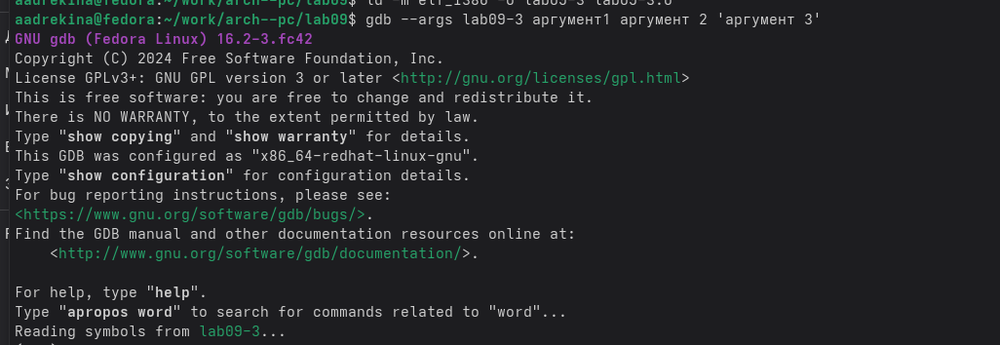{#fig:ris299.jpg width=0.7\textwidth}

Потом я установила точку останова перед первой инструкцией и запустила ее. (Рисунок 7.3)

{#fig:ris80.jpg width=0.7\textwidth}

Я посмотрела позиции стека - по адресу [esp+4].(Рисунок 7.4)

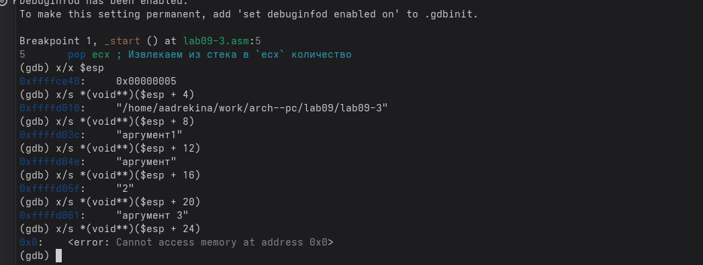{#fig:ris25.jpg width=0.7\textwidth}

Шаг изменения равен 4,так как в данной программе каждый адрес в памяти занимает 4 байта, стек хранит обычный список адресов, и для того чтобы перейти к следующему адресу нужно сдвинутся ровно на 4 байта.

# Задание для самостоятельной работы.

Я преобразовала программу созданную во время выполнения лабораторной работы №8, реализовав вычисления функции f(x) как подпрограмму. (Рисунок 8.1)

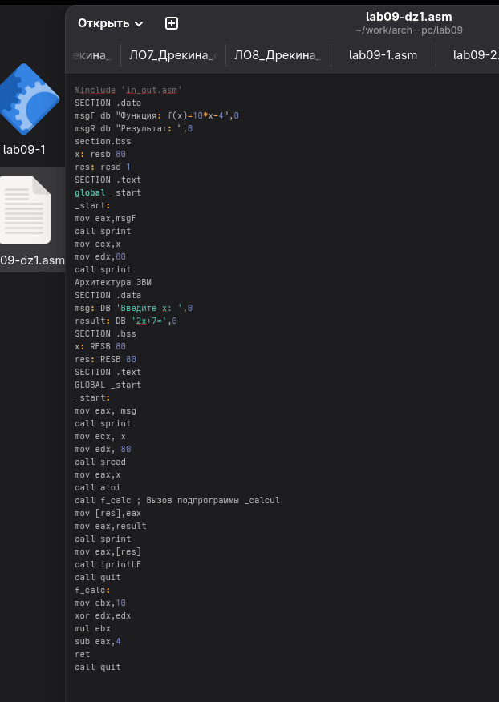{#fig:ris26.jpg width=0.7\textwidth}

Я создала еще один текстовый файл и вставила туда Листинг 9.3. Я начала анализировать эту программу с помощью отладчика GDB, определила ошибки и исправила их. (Рисунок 8.2)

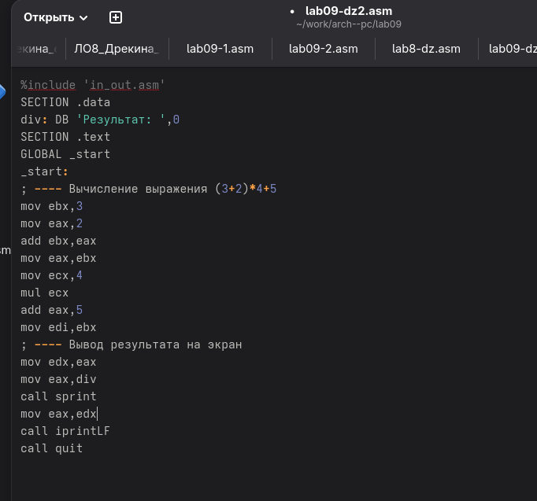{#fig:ris27.jpg width=0.7\textwidth}

Листинг 9.3:

```nasm
%include 'in_out.asm'
SECTION .data
div: DB 'Результат: ',0
SECTION .text
GLOBAL _start
_start:
; ---- Вычисление выражения (3+2)*4+5
mov ebx,3
mov eax,2
add ebx,eax
mov ecx,4
mul ecx
add ebx,5
mov edi,ebx
; ---- Вывод результата на экран
mov eax,div
call sprint
mov eax,edi
call iprintLF
call quit
```

Затем я сделала файл исполняемым и проверила результат, ответы совпали. Значит я правильно изменила программу.

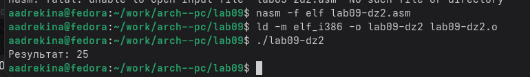{#fig:ris28.jpg width=0.7\textwidth}

# Вывод.

Я приобрела навыки написания программы с использованием подпрограммы. И ознакомилась с методами отладки при помощи GDB и его основными возможностями. 
